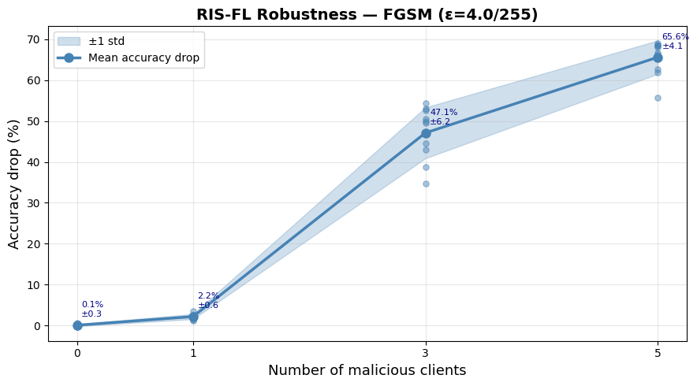
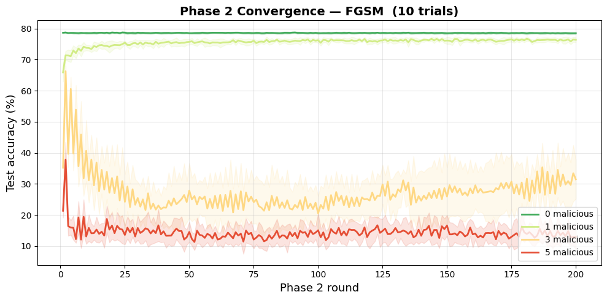

# Robust RIS-Assisted Federated Learning under Adversarial Attacks


## 📌 Abstract
This repository implements an end-to-end simulation framework for **Reconfigurable Intelligent Surface (RIS)-assisted Federated Learning (FL)** over dynamic wireless networks. The system integrates a numerically stable **Gibbs Sampling** algorithm for joint device selection and beamforming optimization, and rigorously evaluates the framework's resilience against **Data Poisoning (FGSM/PGD)** and **Model Poisoning** attacks.

## 🚀 Key Technical Features
* **Numerically Stable Gibbs Sampling:** Solves the NP-Hard combinatorial optimization problem of client selection. Implements Log-Sum-Exp tricks and dynamic Z-score calibration to prevent numerical overflow (NaN/Inf) during variance-based penalization.
* **Alternating Optimization:** Dynamically computes the optimal RIS phase-shift matrix ($\theta$) and Base Station beamforming vector ($f$) to maximize channel gain for selected clients.
* **Decoupled Attack Simulation:** Architected to cleanly separate data-plane threats (FGSM adversarial noise) from control-plane threats (malicious gradient scaling/aggregation poisoning).
* **Paired Monte Carlo Experiments:** Guarantees strict reproducibility via explicit seed determinism, allowing precise statistical isolation of adversarial impacts across identical Rayleigh fading channels.

## 📊 Results & Visualization

### System Robustness against FGSM Attacks
The framework's accuracy degradation was measured across multiple independent trials. The paired experimental design isolates the impact of the attack from the randomness of the wireless environment.



### Convergence and Attack Impact
Phase 1 establishes a clean baseline using Early Stopping. Phase 2 introduces the adversarial clients, demonstrating the immediate impact of poisoned model updates.



## ⚙️ Quick Start

**1. Clone the repository**
```bash
git clone [https://github.com/toantd181/RIS-Federated-Learning.git](https://github.com/toantd181/RIS-Federated-Learning.git)
cd RIS-Federated-Learning
```
2. Install dependencies

```Bash
pip install -r requirements.txt
```
**3. Run the simulation** Execute the Jupyter Notebook `RIS_FL_Gibbs_Final.ipynb`.  
*Note: To perform a quick test, modify the `Config` cell to reduce `num_rounds_phase1` and `NUM_TRIALS`.*

---

## 📁 Repository Structure

```text
RIS-Federated-Learning/
├── README.md                    # Project documentation
├── requirements.txt             # Dependency list
├── RIS_FL_Gibbs_Final.ipynb     # Main simulation framework
└── results/                     # Generated plots and evaluation metrics
```
## 📬 Contact
Trần Đức Toàn - Undergraduate Student, School of Information and Communications Technology (SoICT)  
Hanoi University of Science and Technology (HUST)

GitHub: @toantd181
Email: toan.tranduc1801@gmail.com
